# MindLift - Your Personal Mental Health Chatbot

MindLift is an AI-powered mental health support chatbot that leverages natural language processing (NLP) and sentiment analysis to assist users in managing their emotional well-being. Built using the RASA framework, the chatbot integrates external libraries, multimodal input handling, video recommendations, and personalized sentiment analysis to create an interactive and supportive experience.

## Features

- **Sentiment Analysis:** Uses VADER and NRCLex to analyze user sentiment and provide emotional insights.
- **Multimodal Input Handling:** Supports text, speech recognition, and text-to-speech using the Web Speech API.
- **Video Recommendations:** Suggests relevant videos based on user queries and intent classification.
- **Performance Optimization:** Implements caching mechanisms and asynchronous processing for smooth interactions.
- **Sentiment Report Display:** Generates and displays sentiment analysis reports through a Django-based chatbot interface.

## Installation

Follow these steps to set up the project:

1. Clone the repository:
   ```sh
   git clone https://github.com/saurabhPendam/Rasa_Chatbot.git
   cd mindlift-chatbot
   ```

2. Install dependencies:
   ```sh
   pip install -r requirements.txt
   ```

3. Train the RASA model:
   ```sh
   rasa train
   ```

4. Start the RASA server:
   ```sh
   rasa run -m model --enable-api --cors "*"
   ```
5. Start the Rasa Action server:
   ```sh
   rasa run actions --port 5056
   ```

6. Start the chatbot UI (Django-based):
   ```sh
   python manage.py runserver
   ```

#Database connection
make changes in rasa/actions.py, endpoints.yml, website/views.py.


## Screenshots

### Chatbot Interface
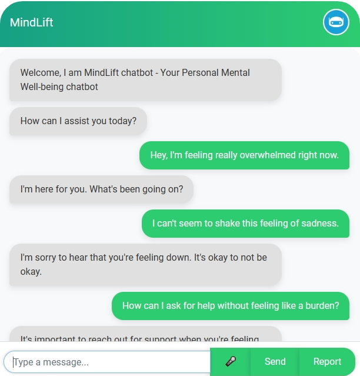
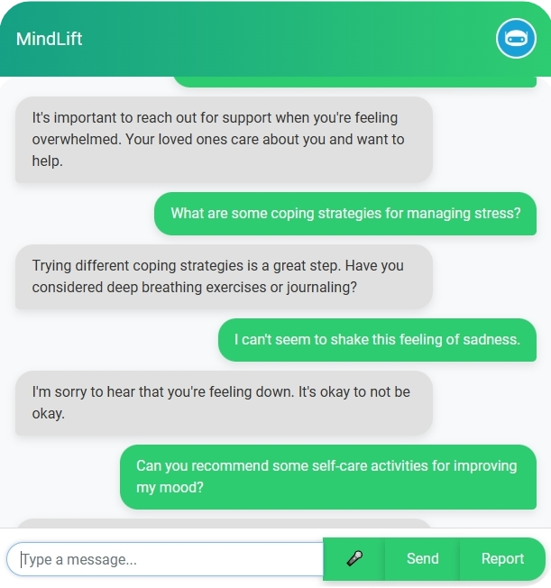
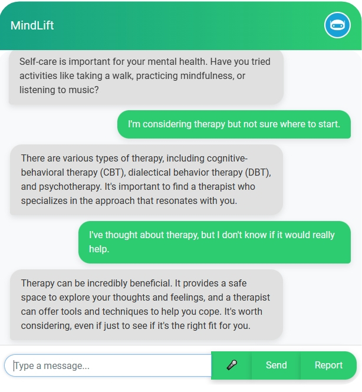
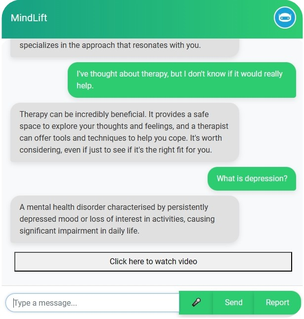
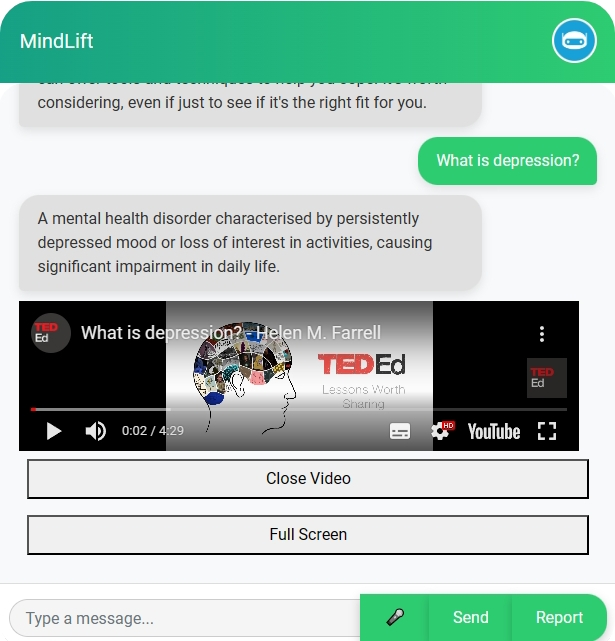
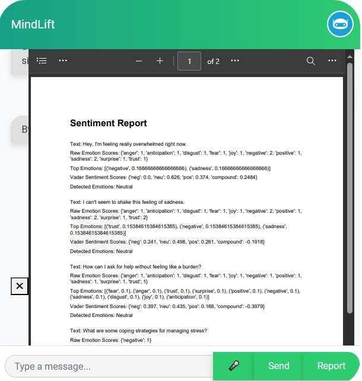

### Chatbot Design
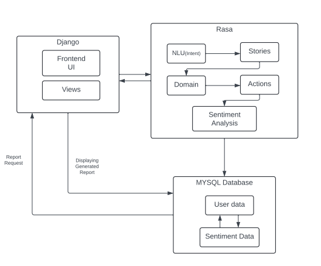

### Evaluation and Analysis

- **Confusion Matrix (Without Normalization)**
  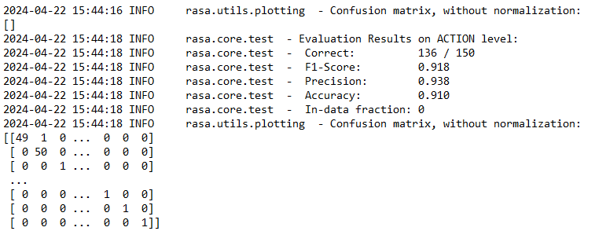

- **Evaluation Result on Conversation Level**
  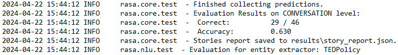

- **Intent Evaluation Result**
  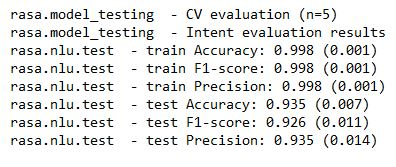

- **Intent Prediction Confidence Distribution**
  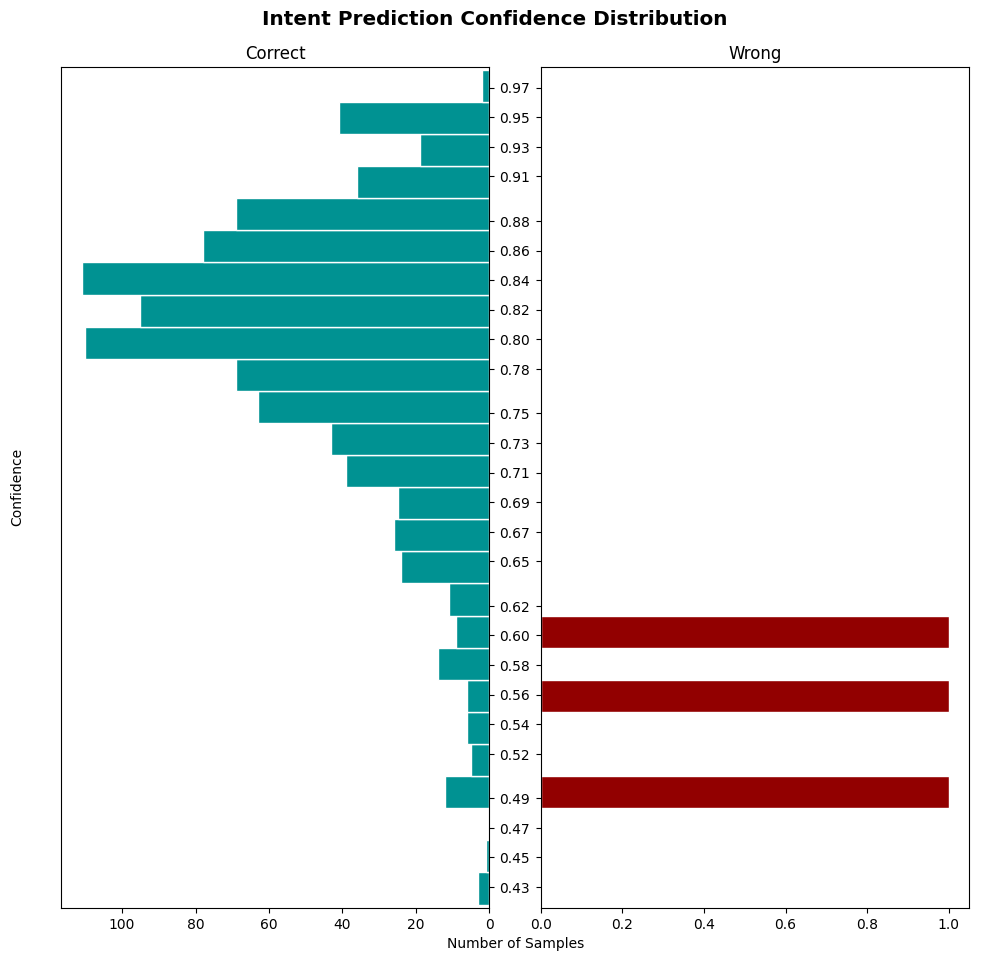

## Future Enhancements

- **Expanded Dataset & Model Retraining:** Improve chatbot accuracy by training on a diverse dataset.
- **Personalization:** Implement user profiling for tailored responses.
- **Integration with Mental Health Services:** Connect users with professional therapists and counselors.
- **Multimodal Analysis:** Utilize facial expression and voice tone analysis for deeper emotional insights.
- **Longitudinal Tracking:** Monitor user sentiment trends over time for personalized recommendations.

## Contributing

Contributions are welcome! Feel free to submit issues or pull requests to improve the chatbot.

## License

This project is licensed under the MIT License - see the [LICENSE](LICENSE) file for details.

---

This updated `README.md` includes all your project images and structured content for GitHub.
